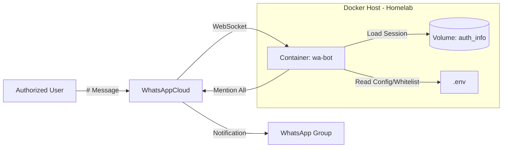

# wa-mention-all (Dockerized Homelab Version)
*Author: KpihX*

## 1. Project Overview

**`wa-mention-all`** is a self-hosted WhatsApp bot designed to run in a **Docker container** within a Homelab environment (e.g., Proxmox LXC).
Its primary function is to **tag/mention every participant** in a WhatsApp group when an authorized user sends a specific command.

It uses the **Baileys** library to communicate directly with WhatsApp servers via WebSocket, making it extremely lightweight and headless (no browser/Selenium required).

### Key Features
- **Dockerized**: Clean deployment with `docker-compose`.
- **Network Resilient**: Configured to work behind strict corporate/university proxies (e.g., École Polytechnique).
- **Persistent Session**: No need to rescan QR code after restarts (via Docker volumes).
- **Secure Whitelist**: Only authorized JIDs (phone numbers) or LIDs defined in `.env` can trigger the bot.
- **Robust Identity Check**: Normalizes IDs to handle Multi-Device mismatches (LID vs JID).
- **Rate Limiting**: Prevents spamming with a configurable throttle delay.

---

## 2. Architecture



**Workflow:**
1. The bot listens for messages starting with `#` (standard) or `#!` (force).
2. It verifies the author against its own identity (`fromMe`) AND the `ALLOWED_IDS` whitelist defined in `.env`.
3. It normalizes IDs to ensure compatibility between Phone Numbers and Linked Device IDs (LIDs).
4. If authorized, it fetches group metadata, mentions all participants, and deletes the trigger message.

---

## 3. Prerequisites

- **Docker** and **Docker Compose** installed on the host.
- A **WhatsApp Account** (can be your main account or a dedicated bot account) to scan the QR code.
- (Optional) HTTP Proxy information if running on a restricted network.

---

## 4. Installation & Setup

### 1. Clone the repository
```bash
git clone https://github.com/KpihX/wa-mention-all.git
cd wa-mention-all
```

### 2. Configuration (`.env`)
Create a `.env` file based on the example. This is critical for security and network access.

```bash
cp .env.example .env
nano .env
```

**Configuration Reference:**

```ini
# --- Anti-Spam ---
# Minimum seconds between two mentions in the same group.
THROTTLE_SEC=2

# --- Security & Whitelist (CRITICAL) ---
# List of authorized users who can trigger the bot.
# Format: CountryCodePhoneNumber@s.whatsapp.net (Standard JID) or UserID@lid (Linked Device ID)
# Multiple IDs must be separated by a comma without spaces.
# Example: 33612345678@s.whatsapp.net,23770873475890@lid
ALLOWED_IDS=336XXXXXXXXX@s.whatsapp.net
```

### 3. Build and Start
This command builds the image (installing dependencies via proxy) and starts the container.
```bash
docker compose up -d --build
```

### 4. Authenticate (Scan QR)
The bot will generate a QR Code in the logs upon first launch.
```bash
docker logs -f wa-bot
```
1. Open WhatsApp on your phone.
2. Go to **Linked Devices** > **Link a Device**.
3. Scan the ASCII QR code displayed in your terminal.
4. Once you see `✅ Bot connecté à WhatsApp avec succès !`, you can exit logs with `Ctrl + C`.

---

## 5. Usage

In any WhatsApp group where you (or the bot account) are a member:

- **Standard Trigger**:
  ```text
  # Hello Team
  ```
  *Result:* The bot replies "📣 Hello Team" and tags everyone. Checks for throttling.

- **Forced Trigger**:
  ```text
  #! Urgent Alert
  ```
  *Result:* Bypasses the throttle timer and tags everyone immediately.

---

## 6. Files Structure

- **`Dockerfile`**: Builds the Alpine Node.js image, installs `git` and dependencies using the proxy defined in build args.
- **`docker-compose.yml`**: Orchestrates the container, injects `.env` variables, and manages the persistent volume.
- **`bot.js`**: The main logic script. Handles connection, ID normalization, and message processing.
- **`.dockerignore`**: Prevents local garbage (`node_modules`, `auth_info`) from polluting the container build.
- **`.gitignore`**: Prevents secrets (`.env`, `auth_info/`) from being pushed to the Git repository.

---

## 7. Troubleshooting

### The bot connects but ignores my commands
- **Cause**: Identity mismatch. WhatsApp Multi-Device often sends a LID (Linked Identity ID) which differs from your Phone JID.
- **Solution**:
    1. Check logs: `docker logs -f wa-bot`.
    2. Look for the line: `📩 Commande reçue de [12345...@lid]`.
    3. Copy this ID.
    4. Add it to `ALLOWED_IDS` in your `.env` file (comma-separated).
    5. Restart: `docker compose up -d`.

### "npm install" fails during build
- **Cause**: Network restriction / Proxy issue.
- **Solution**: Ensure `http_proxy` variables are correctly set in the `.env` file. The `Dockerfile` is configured to consume these variables as build arguments.

### Session loop / Disconnects
- **Cause**: The `auth_info` folder might be corrupted or invalid.
- **Solution**:
    1. Stop the bot: `docker compose down`.
    2. Delete local session data: `rm -rf auth_info/`.
    3. Restart and rescan QR: `docker compose up -d`.

---

## 8. Maintenance commands

**Update the bot code:**
```bash
git pull
docker compose up -d --build
```

**View live logs:**
```bash
docker logs -f wa-bot
```

**Restart the bot:**
```bash
docker compose restart wa-bot
```

---

## 9. License & Disclaimer

**Author:** KpihX  
This project is for educational and personal use.  
**Warning**: Spamming "mention all" in groups can lead to account bans by WhatsApp. Use responsibly and only in groups where you have permission.
```